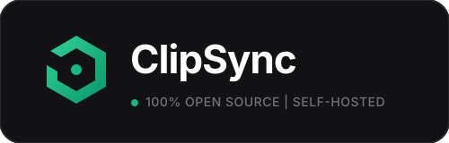

<p align="center">
  
</p>

<p align="center">
  <strong>A lightweight, zero-bloat, self-hosted cross-device clipboard and file drop engine with sub-millisecond latency.</strong>
</p>

ClipSync allows any device on the same local network (laptops, phones, tablets) to seamlessly share clipboard text, URLs, code snippets, and files in real-time. Built with a modern developer utility aesthetic (Linear / Raycast / Vercel style) and strict dark mode.

---

## 🏛️ System Architecture

```text
               +-------------------------------------------------+
               |              ClipSync Server (Node.js)          |
               |                                                 |
               |   +-------------------+   +------------------+  |
               |   | Express REST API  |   | WebSocket Server |  |
               |   |  - /api/v1/upload |   |     (ws path)    |  |
               |   |  - /api/v1/download   |  - sync:new_item |  |
               |   |  - /api/v1/info   |   |  - sync:history  |  |
               |   |  - /api/v1/qr     |   |  - sync:delete   |  |
               |   +---------+---------+   |  - sync:clear    |  |
               |             |             |  - peer_count    |  |
               |             v             +--------+---------+  |
               |   +-------------------+            |            |
               |   | Ephemeral Storage |            |            |
               |   |    (/uploads)     |            v            |
               |   +-------------------+   +------------------+  |
               |                           | In-Memory Buffer |  |
               |                           |  (20-slot ring)  |  |
               |                           +------------------+  |
               +-------------------------------------------------+
                                      ▲
                                      │ Sub-millisecond LAN Broadcast
             ┌────────────────────────┼────────────────────────┐
             ▼                        ▼                        ▼
    +-----------------+      +-----------------+      +-----------------+
    |   Desktop PC    |      |  MacBook Pro    |      | Mobile / Tablet |
    | (Windows/Linux) |      |    (macOS)      |      |   (iOS/Android) |
    |   [Ctrl + V]    |      |   [Cmd + V]     |      |  [QR Scan & Tap]|
    +-----------------+      +-----------------+      +-----------------+
```

### Run with Docker Compose
```bash
docker compose up -d
Open http://localhost:3000 in your browser.
```

---

## ✨ Features

- **Sub-Millisecond Real-Time Sync**: Instant broadcasting using native WebSockets (`ws`).
- **Auto-Copy to System Clipboard (v1.1)**: Incoming text clips are automatically written to your system clipboard when enabled, featuring persistent toggle state and tactile green visual feedback.
- **Keyboard-First UX**: Press `Ctrl+V` or `Cmd+V` anywhere on the page to instantly broadcast text or images. Press `Ctrl+Enter` to broadcast typed notes.
- **Smart Content Classification**: Automatically identifies and categorizes content into `TEXT`, `CODE`, `LINK`, `IMAGE`, or `FILE`.
- **Drag & Drop Anywhere**: Drop any file onto the window to upload and distribute to all connected peers.
- **Pasted Screenshot Support**: Pasting image data from your clipboard automatically converts it into a shareable asset.
- **Single-Click Copy**: Copies to native clipboard with immediate tactile feedback (`Copied!`).
- **QR Code Pairing**: Built-in LAN QR code modal lets phones and tablets scan and connect in seconds without typing IPs.
- **In-Memory Ring Buffer**: Ultra-fast in-memory queue (last 20 clips) with automatic file cleanup upon eviction and optional disk persistence (`clipsync-data.json`).
- **Strict Developer Dark Mode**: Built with `#0a0a0c` dark background, `#18181b` card surfaces, and `#27272a` borders. Zero marketing fluff, zero bloat.

---

## 📁 Directory Structure

```text
clipsync/
├── package.json               # Project manifest and scripts
├── server/
│   ├── index.js               # Server entrypoint (HTTP + WS + Static SPA fallback)
│   ├── config.js              # Config defaults & environment variable overrides
│   ├── networkUtils.js        # Discovers LAN IPv4 addresses (Wi-Fi / Ethernet)
│   ├── ringBuffer.js          # In-memory FIFO ring buffer with eviction cleanup
│   ├── wsHandler.js           # Real-time WebSocket connection & broadcast manager
│   ├── routes.js              # REST endpoints (/upload, /download, /info, /qr, /history)
│   └── test-integration.js    # Automated end-to-end integration test suite
├── public/
│   ├── index.html             # Single-view developer utility UI
│   ├── css/
│   │   └── style.css          # Linear/Raycast dark theme & micro-interactions
│   └── js/
│       ├── app.js             # Main state controller & UI bindings
│       ├── websocket.js       # Auto-reconnecting WebSocket client
│       └── clipboard.js       # Content classifier, device detection & clipboard API
├── uploads/                   # Ephemeral upload folder (auto-managed)
├── .gitignore
└── README.md
```

---

## 🚀 Quick Start

### 1. Prerequisites
- **Node.js**: v18.0.0 or later (Node 20+ recommended)
- **npm**: v9+

### 2. Install Dependencies
```bash
npm install
```

### 3. Run Server
```bash
npm start
```
Or run with auto-reload during development:
```bash
npm run dev
```

Upon launching, ClipSync displays the active network URLs in your terminal:
```text
──────────────────────────────────────────────────────
  ⚡ ClipSync — Cross-Device Clipboard & File Drop
──────────────────────────────────────────────────────
  • Local:       http://localhost:4040
  • Network:     http://192.168.29.201:4040
  • QR Code:     http://192.168.29.201:4040/api/v1/qr
  • Max History: 20 items in memory buffer
──────────────────────────────────────────────────────
  Ready. Press CMD/CTRL+V anywhere or drop files to sync.
```

---

## 📱 LAN Setup & Cross-Device Access

### Finding Your Local IP Manually (Optional)
ClipSync **automatically detects and displays** your primary LAN IP when started. If you wish to check manually:

- **Windows**:
  ```powershell
  ipconfig
  ```
  Look for `IPv4 Address` under your active Wi-Fi or Ethernet adapter (e.g., `192.168.1.50`).

- **macOS / Linux**:
  ```bash
  ipconfig getifaddr en0   # macOS Wi-Fi
  hostname -I              # Linux
  ```

### Connecting Phones & Other Devices
1. Ensure both devices are connected to the **same Wi-Fi network**.
2. On your primary computer, click the **"Connect Phone"** button in the top bar.
3. Open your mobile phone's Camera app and scan the QR code.
4. Tap the link to open ClipSync in your mobile browser.
5. You can now copy text or drop photos on your phone, and they will immediately appear on your desktop, and vice versa!

---

## ⚙️ Configuration & Environment Variables

You can customize ClipSync by setting environment variables or running with flags:

| Variable | Default | Description |
| :--- | :--- | :--- |
| `PORT` | `4040` | Port for HTTP & WebSocket server |
| `HOST` | `0.0.0.0` | Bind address (`0.0.0.0` listens on all network interfaces) |
| `MAX_HISTORY` | `20` | Maximum number of items in the in-memory ring buffer |
| `MAX_FILE_SIZE_MB` | `100` | Maximum file upload size in megabytes |
| `PERSIST_TO_DISK` | `true` | Persist clips across restarts via `clipsync-data.json` |

Example:
```bash
PORT=8080 MAX_HISTORY=30 npm start
```

---

## 🧪 Testing

An automated integration test is included that tests REST endpoints, WebSocket message exchanges, file uploads, file downloads, and history pruning:

```bash
node server/test-integration.js
```

---

## 📝 Changelog

See detailed release history in [CHANGELOG.md](CHANGELOG.md).

---

## 📄 License
MIT

